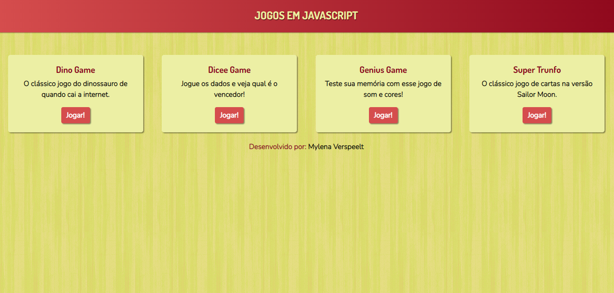

# Jogos em JS

Aqui estão todos os jogos que fiz durante minha jornada como desenvolvedora, vou atualizando conforme for produzindo mais!

Todos os jogos foram feitos com HTML, CSS e vanilla Javascript, utilizei Bootstrap apenas na página inicial.

Para mais detalhes, ler o ReadMe de cada um deles

Para acessar basta clicar no link:  https://mylenaverspeelt.github.io/jogos-javascript/

Desenvolvido por: Mylena Verspeelt 🌻
